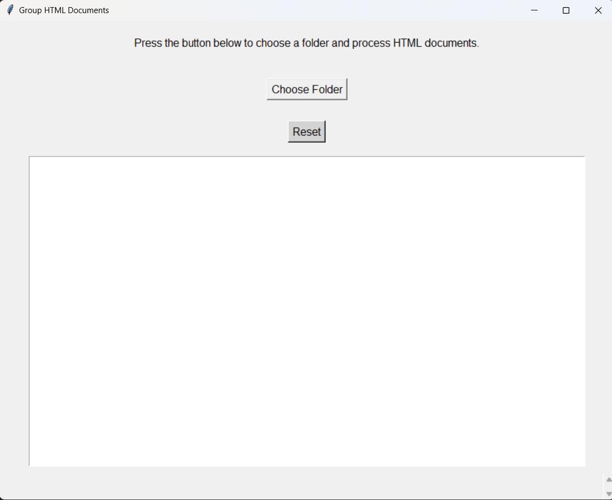

# HTML Clones

## Project Overview

This Python application is designed to group similar HTML clones based on their textual content using advanced text similarity and clustering techniques. The tool leverages machine learning algorithms to analyze and cluster HTML documents across multiple complexity levels.

## Technical Approach

The solution uses a multi-step process to group similar documents:

1. **Text Extraction**: 
   - Uses BeautifulSoup to parse HTML files
   - Extracts clean text content from HTML documents

2. **Feature Vectorization**:
   - Applies TF-IDF (Term Frequency-Inverse Document Frequency) vectorization
   - Converts text into numerical feature vectors

3. **Similarity Measurement**:
   - Computes cosine similarity between document vectors
   - Creates a similarity matrix representing document relationships

4. **Clustering**:
   - Employs DBSCAN (Density-Based Spatial Clustering of Applications with Noise)
   - Groups documents based on similarity thresholds
   - Handles varying dataset complexities

## Prerequisites

- Python 3.8+
- Required Libraries

## Installation

### 1. Clone the Repository
```bash
git clone https://github.com/yourusername/html-clones-grouper.git
cd html-clones-grouper
```

### 2. Create Virtual Environment
```bash
python3 -m venv venv
source venv/bin/activate  # On Windows, use `venv\Scripts\activate`
```

### 3. Install Dependencies
```bash
pip install beautifulsoup4
pip install scikit-learn
pip install numpy
pip install tk
```

## Usage

### Running the Application
```bash
python html_clones_grouper.py
```

### How to Use
1. Click "Choose Folder"
2. Select a directory containing HTML clone files
3. View grouped documents in the output window

## Screenshot



## License
MIT License

Copyright (c) [year] [fullname]

Permission is hereby granted, free of charge, to any person obtaining a copy
of this software and associated documentation files (the "Software"), to deal
in the Software without restriction, including without limitation the rights
to use, copy, modify, merge, publish, distribute, sublicense, and/or sell
copies of the Software, and to permit persons to whom the Software is
furnished to do so, subject to the following conditions:

The above copyright notice and this permission notice shall be included in all
copies or substantial portions of the Software.

THE SOFTWARE IS PROVIDED "AS IS", WITHOUT WARRANTY OF ANY KIND, EXPRESS OR
IMPLIED, INCLUDING BUT NOT LIMITED TO THE WARRANTIES OF MERCHANTABILITY,
FITNESS FOR A PARTICULAR PURPOSE AND NONINFRINGEMENT. IN NO EVENT SHALL THE
AUTHORS OR COPYRIGHT HOLDERS BE LIABLE FOR ANY CLAIM, DAMAGES OR OTHER
LIABILITY, WHETHER IN AN ACTION OF CONTRACT, TORT OR OTHERWISE, ARISING FROM,
OUT OF OR IN CONNECTION WITH THE SOFTWARE OR THE USE OR OTHER DEALINGS IN THE
SOFTWARE.
